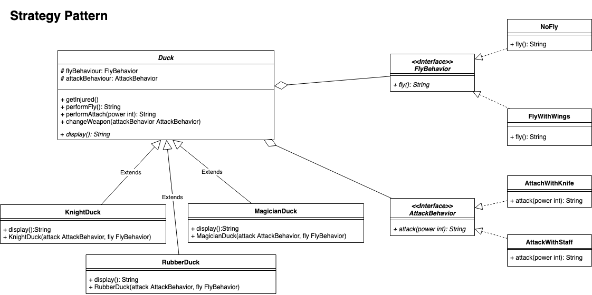

The partial code for this lab can be found [here](https://gitlab.cecs.anu.edu.au/u1009226/comp2100-labs/tree/master/lab5).


## Task 1 - Duck Game [0.5 marks]

Through out the first task, we will study how to interpret UML diagram with an example of stratege design pattern. Additionally, you will remind/understand some important OOP concepts such as inheritance, polymorphism and overriding throughout this tasks.

The UML diagram of duck game is shown below, and PDF copy of the diagram can be found in the [lab repository](https://gitlab.cecs.anu.edu.au/u1009226/comp2100-labs/tree/master/lab5). As you may noticed the diagram visualise the strategy pattern we have studed in the lecture. During the lecture, we only talked about fly-behavior of ducks, but in this example, we also have attack-behaviour, which is also modelled with the strategy pattern.



__Your job is to convert this UML diagram into the actual java code__. You need to create corresponding java classes and write code based on the diagram. As we have discussed in the lecture, the UML does provide details of how the classes interact with each other, and how a particular method is implemented. To fill the missing details, we have provided JUnit test file `DuckTest.java`. Please read the test file carefully, before you start the implementation. In addtion, we have provided concrete implementation of four methods in Duck class (see below). Your final implementation should __pass all test cases__ in the test class.

Use the following definition of the concrete methods to implement abstract `Duck` class:
```java

	public String performAttack(int power) {
		return attackBehavior.attack(power);
	}
	
	public String performFly() {
		return flyBehavior.fly();
	}
	
	public void getInjured() {
		this.flyBehavior = new NoFly();
	}
	
	public void changeWeapon(AttackBehavior behavior) {
		attackBehavior = behavior;
	}
```

- All classes are public classes.
- The constructor of three subclasses of `Duck` should take FlyBehaviour and AttackBehavior instances as its arguments and store them to the private members of the class.
- To complete a certain method of classes such as `display`, `fly`, and `attack`, you need to check the test file. Please read the test file carefully and write methods that can pass all test cases.
- Be aware the the members and methods of classes should be implemented with the same visibility modifier (public, protected, private, and package), return type, and input arguments as written in the UML diagram.


## Task 2 - Observer Pattern [0.5 marks]

Throughout the second task, we will study the basic concept of observer pattern and how the observer pattern can be implemented in Java code. We will again use the duck example for the second task with modified class structures.

Let's say you are a quackologist(!) who wants to study every duck that can quack. As a quackologist, you wish to track all ducks that quack. Luckly, you have noticed that every duck is observable, which means that you can add yourself as an observer of a duck. Although all ducks are observable, it seems they do not learn how to notify their observers when they quack. Your job is to implement the missing part of `Duck` class to make sure that the quackologist can be notified whenever a duck quacks.

In the provided partial code, we have three duck classes: Knight, Magician, and Rubber ducks. Each of these ducks extends abstract class `Duck`, which implements interface `Quackable` and `Observable`. 
- `Observable` interface contains abstract method `registerObserver(Observer observer)` and `notifyObservers()`. Your job is to implement these two methods:
  - `registerObserver`: takes an observer as an argument and registers (adds) the observer to the `observerList`
  - `notifyObservers`: iterates over all registered observer and calls update.
- `Quackable` interface contains abstract method `quack()`, however, abstract class `Duck` did not implement this method. Therefore, all three duck classes should implement `quack()` method by themselves. Your job is to implement the missing part `quack` method of each subclass to make sure that the quackologist can be notified whenever a duck quacks.

Additional tips:
- Note that the amount of coding required for this task is very small. Keep focusing on understanding how the observer pattern works.
- It would be helpful if you draw UML diagram of the classes (this is not the part of this task but it will help your understanding)
- You may find some code redundancy while implementing the code. What would be a good way to remove this redundacy? Can strategy pattern help? Again this is not the part of this task but worth to think about.


## Submission Guideline

* Assignment deadline: Friday, 6 September 2019, 11:55 PM
* Submission mode: Electronic, via Wattle (Lab 5)
* Submission format (IMPORTANT):
  * Upload your final version of java files to Wattle.
  * You should upload (`task1.zip` or `task1.rar`) and (`task2.zip` or `task2.rar`) to Wattle submission page (2 compressed files).
  	* Compress task1 folder containing all java files via zip or rar compression format.
  	* Compress task2 folder containing all java files via zip or rar compression format.
  * Do not change the structure of the partial code including class names and package structure.
  * You may use standard libraries to complete the tasks, but it is not allowed to use external libraries.
    * Do not import packages outside of the standard java SE package. The list of available packages can be found here: [https://docs.oracle.com/en/java/javase/12/docs/api/index.html](https://docs.oracle.com/en/java/javase/12/docs/api/index.html)   
    * Some IDEs (such as NetBeans) will automatically import some libraries. Please remove these libraries before submit.
  * Violation of the submission format will have their assignment not evaluated by an autograder and get zero marks.

